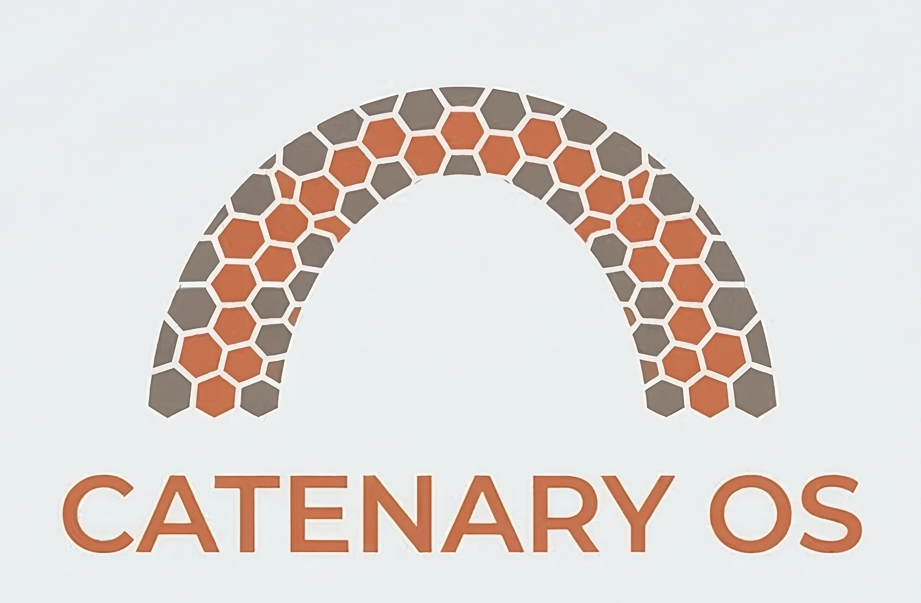

<p align="center">
  
</p>

<h1 align="center">CATENARY OS</h1>

<p align="center">
  <em>A distributed microkernel & bare-metal Type-1 hypervisor, written in Zig.</em>
</p>

<p align="center">
  
  
  
  
</p>

---

## What is Catenary OS?

A **catenary** is the precise mathematical curve a cable forms under its own weight — a perfect load-bearing arc that distributes massive tension into pure compression across its span. Just as a catenary turns raw structural forces into elegant, predictable geometry, **Catenary OS** distributes the weight of isolated MicroVMs and containers across an IPv6 network of bare-metal nodes into a seamless, load-bearing orchestration fabric.

Catenary OS discards legacy monolithic designs and in-kernel POSIX compatibility. It natively orchestrates OCI (Docker) containers by running them inside hardware-isolated **MicroVMs**, interconnected via an **IPv6-first** distributed message-passing network — with zero-trust cryptographic identity baked in at the IPC layer.

---

## Architecture

### The Exokernel (Ring 0)

The kernel is stripped to the absolute minimum. It handles only:

- **Physical Memory Allocation** — page frame management via Zig's explicit allocators
- **CPU Scheduling & Context Switching** — assembly-backed task management with TCBs
- **Hardware Virtualization (Intel VT-x)** — initializing and managing hypervisor VMX state
- **Local IPC** — asynchronous message-passing queues between processes

### User Space (Ring 3)

Everything else lives in isolated user-space processes:

- Device drivers (via securely granted DMA/IOPL)
- The network stack
- Catenary routing and orchestration daemons

### Distributed IPC

Processes communicate via a unified message-passing API. The OS routes messages transparently whether the target lives on the local CPU or on another bare-metal node across the network — making cluster orchestration a **native OS capability**.

### IPv6-Native Networking

- Every isolated process, MicroVM, and node receives a unique `/128` IPv6 address
- Zero-trust: cryptographic identity and IPsec are baked into IPC messages at the network layer
- Legacy IPv4 handled by an isolated user-space NAT64/DNS64 gateway

### MicroVM Container Engine

Catenary OS acts as a **Type-1 hypervisor**, booting stripped-down Linux kernels (< 20 MB) inside MicroVMs to achieve full OCI (Docker) compatibility without emulating Linux syscalls in user space.

---

## Technology Stack

| Component | Choice | Rationale |
|-----------|--------|-----------|
| Language | **Zig** (`x86_64-freestanding`) | Explicit allocators, no hidden control flow, `comptime` metaprogramming, seamless C-interop |
| Architecture | **x86_64** | Initial target; Intel VT-x for hardware virtualization |
| Bootloader | **Limine** | Skips legacy 16-bit BIOS; enters 64-bit Long Mode with a prepared memory map and framebuffer |
| Emulation | **QEMU** | `-serial stdio` for raw kernel serial output and hardware fault diagnosis |

---

## Development Roadmap

- [x] **Phase 1: Bare-Metal Foundation** — Bootloading, build system, and basic output.
- [x] **Phase 2: Core Abstractions** — CPU descriptors and physical memory management.
- [x] **Phase 3: Scheduling & IPC** — Task switching and local message passing.
- [x] **Phase 4: Hypervisor & MicroVMs** — Intel VT-x integration and booting isolated Linux guest kernels.
- [x] **Phase 5: Networking & Orchestration** — IPv6 networking, distributed IPC, and multi-node cluster orchestration.
- [ ] **Phase 6: Storage & Persistent State** (*Current*) — NVMe drivers, block I/O, and encrypted storage volumes.

---

## Building & Running

**Prerequisites:** Zig, QEMU with x86_64 support, `xorriso`, and the checked-in Limine bootloader files under `limine/`. Rebuilding the embedded guest initramfs also requires `cc`, `fakeroot`, `cpio`, and `gzip`.

```sh
# Build the kernel
zig build

# Run in QEMU (serial output to stdout)
./run_qemu.sh

# Default smoke test (core boot + Ring 3 service milestones)
./test_qemu.sh

# Direct VMX/Linux validation
SMOKE_PROFILE=vmx-linux ./test_qemu.sh

# Integrated services-owned Linux MicroVM validation
SMOKE_PROFILE=vmx-linux-services ./test_qemu.sh
```

Additional build/run notes and bring-up options are documented in [docs/SETUP.md](docs/SETUP.md).

By default, the smoke test checks core boot and service milestones.
For VMX/Linux bring-up, use the named `SMOKE_PROFILE`s shown above, or override `ZIG_BUILD_ARGS`, `CORE_PATTERNS`, and `VMX_LINUX_PATTERNS` directly when you need a custom milestone set.
If your environment cannot expose nested VMX to the Catenary OS guest, the VMX/Linux smoke test will fail early.

## Guest Assets

VMX/Linux validation expects a guest kernel image at `assets/guest/linux-bzImage`.

```sh
# Fetch a known-good Alpine bzImage
./dev/download_linux.sh

# Rebuild the embedded initramfs after guest init or rootfs changes
./dev/rebuild_guest_initramfs.sh
```

The embedded initramfs carries the current guest handoff path and a small OCI-style demo rootfs under `/mnt/container`.
Rebuild it after editing `guest_init.c` or `assets/guest/rootfs_init.c`.
See [assets/guest/README.md](assets/guest/README.md) for the guest-kernel and rootfs details.

---

## Design Philosophy

Catenary OS is built under three strict constraints:

1. **No "Vibe Coding" Ring 0** — No inventing memory management or scheduling paradigms that mimic Linux. All decisions derive from the microkernel blueprint.
2. **Interface-First** — Core Zig structs (`ThreadControlBlock`, IPC messages, etc.) are designed before any underlying plumbing is written.
3. **Debug via Serial** — Hardware faults are diagnosed from QEMU register state and serial dumps, never by guessing.

---

## 🧠 About This Project: A Hobby OS Built with AI

Welcome to my hobby project! Catenary OS is an operating system built from scratch from the ground up, heavily utilizing AI assistants like GitHub Copilot. The primary goal is not just to build an OS for fun and learning, but also to stress-test an AI's capacity for logical reasoning, architectural design, and bare-metal coding when dealing with complex, novel constraints.

To prevent the AI from simply regurgitating existing templates, the project enforces a strict set of "hard mode" constraints:

* **The Language Constraint (Zig):** Written entirely in Zig. Zig has a substantially smaller training corpus than C/C++ or Rust, which reduces the risk of the AI pattern-matching against well-known codebases and forces the synthesis of novel logic rather than recycling familiar templates.
* **No Linux/Unix DNA in the Kernel:** Ring 0 is strictly forbidden from referencing, copying, or emulating Linux kernel internals, Unix architecture, or POSIX standards. The microkernel design must be entirely original. (OCI/Docker compatibility is achieved the honest way: by running real Linux kernels inside hardware-isolated MicroVMs, not by reimplementing Linux semantics in the kernel.)
* **Freestanding Environment:** Built entirely from scratch on bare metal. No libc, no OS-level syscall wrappers, and no existing OS-level safety nets. Zig's standard library is used only for the OS-independent utilities it provides in freestanding mode (formatting, data structures, math) — everything requiring a host OS is off-limits.

This repository serves as both a functional custom hobby operating system and a documented log of how large language models handle novel architectures, low-level hardware interactions, and zero-dependency environments.

---

## License

Licensed under the [Apache License, Version 2.0](LICENSE).

See [CONSTITUTION.md](CONSTITUTION.md) for the full architectural blueprint.  
See [CONTRIBUTING.md](CONTRIBUTING.md) to contribute.
